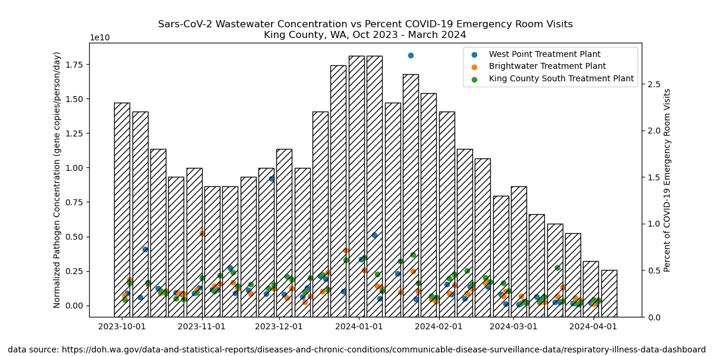

# WW_VS_ER
Script that plots Covid wastewater detection against the percent of COVID emergency room visits in King County, WA from October 2023 to March of 2024.

## Data sources
The CSVs used in this script were downloaded from Washington State's Department of Health Respiratory Illness dashboard, at https://doh.wa.gov/data-and-statistical-reports/diseases-and-chronic-conditions/communicable-disease-surveillance-data/respiratory-illness-data-dashboard. The two specific sources used were from the disease activity and wastewater sections.

## Run this code
This Python3 script uses the pandas and mathplotlib modules. Any recent version of Python3 will work.

## Code output
The code produces a plot that looks like this: 

## License
This code is licensed under the MIT license.
